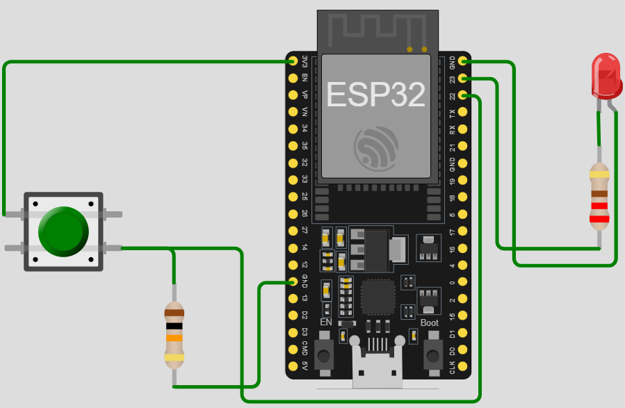

# ESP32-008-Reaction-Time-game-with-ESP32⚡
Test your reflexes with this Reaction Time Game using ESP32, LEDs, and a push button! When the LED lights up, press the button as quickly as possible. The ESP32 records your reaction time — a fun and educational project to learn timing, input handling, and LED control.

---

## 🛠 Components Required

1. [ESP32 Development Board (30-pin)](https://robocraze.com/products/nodemcu-32-wifi-bluetooth-esp32-development-board30-pin?_pos=3&_psq=ESP32&_ss=e&_v=1.0)
2. [5mm Red LED](https://robocraze.com/products/5mm-red-led-pack-of-11?_pos=2&_sid=50b0f0e3d&_ss=r)
3. [Push Button](https://robocraze.com/products/4-pins-dip-momentary-square-tactile-push-button-switch-10-pieces-6x6x5mm?_pos=1&_sid=7a5518733&_ss=r)
4. [220Ω Resistor](https://robocraze.com/products/220-ohm-resistor-pack-of-10?_pos=1&_psq=220&_ss=e&_v=1.0)
5. [Breadboard](https://robocraze.com/products/breadboard?_pos=3&_psq=BREADBOARD&_ss=e&_v=1.0)
6. [Jumper Wires (Male-to-Female, 20cm, 40pcs)](https://robocraze.com/products/f2m-jumper-wires-20cm-40pcs?_pos=1&_psq=JUMPER+WIRES&_ss=e&_v=1.0)

---

## 🎥 Project Demo

* Instagram Reel 👉 [Watch Here](https://www.instagram.com/reel/DOD7TFHE0Wa/?igsh=MTU2aGl5dDUxaTVxcg==)

---

## Circuit Diagram

---

